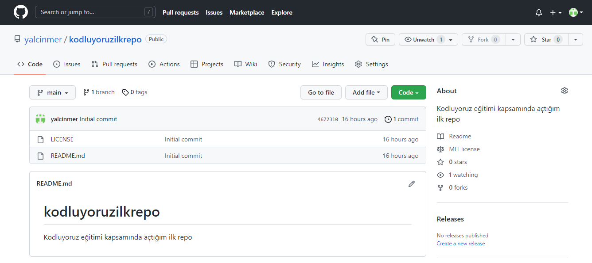

# kodluyoruzilkrepo
Kodluyoruz eğitimi kapsamında açtığım ilk repo

# Kodluyoruz Ilk Repo
Bu repo [kodluyoruz](https://kodluyoruz.org/tr/kodluyoruz/) Front-End eğitiminde oluşturduğumuz ilk repo. İçerisinde bir adet README dosyası bir adet de index.html barındırıyor.



## Installation
Öncelikle projeyi clonelayın.

`git clone https://github.com/yalcinmer/kodluyoruzilkrepo.git`

## Usage
Projeyi cloneladıktan sonra Visual Studio programında açınız.

Linux için:
```
cd kodluyoruz ilk repo
code .
```
## Contributing
Pull requestler kabul edilir. Büyük değişiklikler için, lütfen önce neyi değiştirmek istediğinizi tartışmak için bir konu açınız.

## Licence
[MIT](https://choosealicense.com/licenses/mit/)
